<!-- Neon banner -->

  

<h1 align="center">Hi, I'm Eskinder Kassahun</h1>

  <b>Cloud • DevOps • Security • AI Explorer</b> 
  <i>Atlanta, GA</i>

<!-- Typing animation -->

  

<!-- Social -->

  
  
  
  

---

## 👋 About Me
- Cloud & security-minded software engineer (B.S. CS, AWS re/Start grad, Full-Stack Bootcamp)
- Building with **AWS • Python • React/TypeScript • Node • Terraform**
- Learning **AWS Solutions Architect** + **CompTIA Security+**
- Goal: Cloud/DevOps role where I can automate, secure, and ship faster

---

## 🛠 Tech Stack

  

---

## 🧭 Skill Radar
<!-- Tip: tweak the numbers (0–100) to match your self-rating -->

  

---

## 📊 Highlights (clean 2-column layout)

  
  

  
  

<!-- Optional: full-width activity graph -->

  

---

## 📈 Metrics (auto-updated)

  

---

## ⭐ Featured Projects
| Project | Description | Repo |
|---|---|---|
| **AstraFocus** | Task Tracker + Pomodoro with neon live background | [Repo](https://github.com/Eskinder185/tasktracker) |
| **JohnnyCloud** | Intelligent AWS file pipeline (S3 + Lambda + SNS) | [Repo](https://github.com/Eskinder185/johnnycloud) |
| **Artemis Security Hardening** | Secure web app with modern security practices | [Repo](https://github.com/Eskinder185/java-security-hardening-artemis) |
| **Treasure Hunt DQN** | AI pathfinding with Deep Q-Learning | [Repo](https://github.com/Eskinder185/treasure-hunt-dqn) |

  
  

---

## 🐍 Fun (neon snake)

  <!-- Use the workflow-based contribution snake -->
  
  <!-- Or your custom always-on SVG: -->
  <!--  -->

---

## 💬 A Note
I’m building in public — learning, shipping, and iterating.  
If you have ideas or want to collaborate on cloud + security + productivity tools, reach out!

